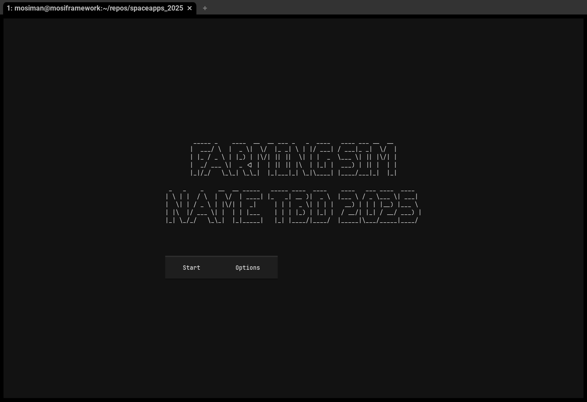
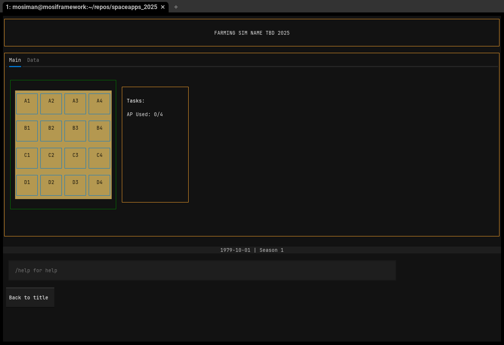
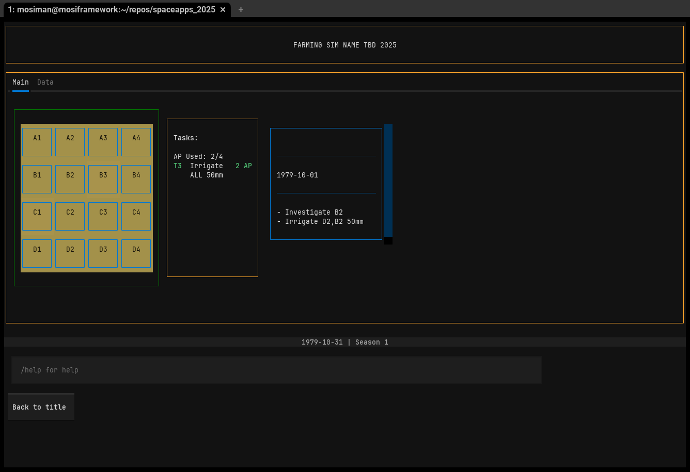
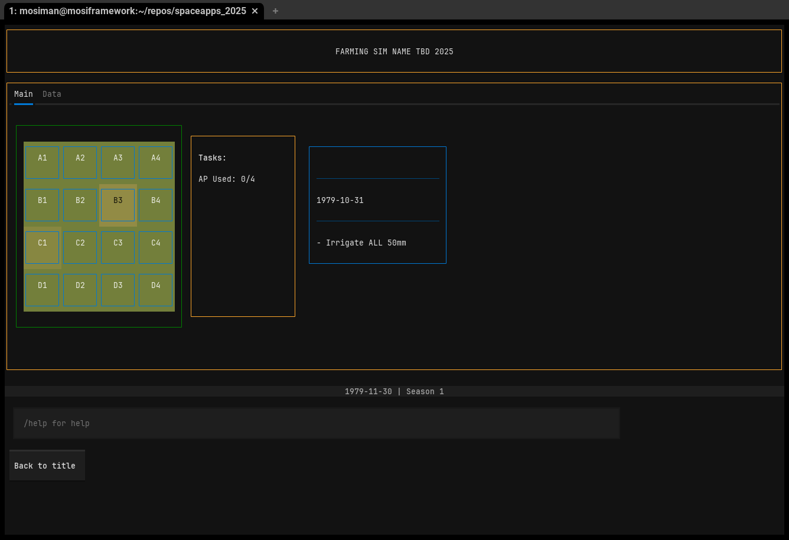
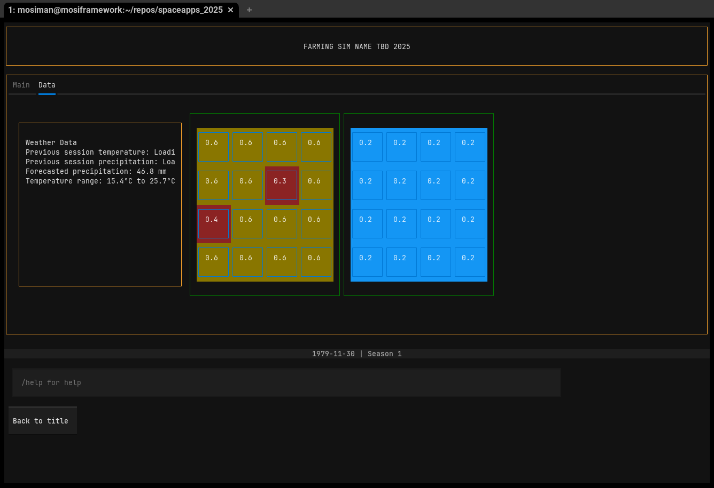

# NASA SpaceApps 2025 (Ottawa)

## Project Overview
This repository is my submission for the 2025 NASA SpaceApps hackathon, for the following challenge.

**Challenge** : NASA Farm Navigators: Using NASA Data Exploration in Agriculture

Before describing the project, let's outline the goals of this project:

1. The primary objective is to educate and be illustrative.
2. The secondary objective is for the gameplay to map cleanly to existing data sets.
3. The tertiary objective (stretch goal) is for the game to be based entirely on real-world data.

### TermHarvest: A Farming Simulator

`TermHarvest` is a game with the primary goal of illustrating how satellite data can improve farming practices.

The player starts out with very minimal information, but with each growing season gains additional data that can be used to increase yields.

In particular the game aims to highlight the utility of two types of data: Normalized Difference Vegetation Index (NDVI) and Soil Moisture Active Passive (SMAP).

NDVI helps to quantify the health and density of vegetation using satellite data. Especially combined with data from previous seasons, this can help detect anomalies that warrant investigation (for example, a pest infestation that slows or reduces canopy cover growth). This kind of data can help with targeted pesticide application, reducing overall pesticide use.

SMAP data helps to quantify the soil moisture content. While it may only sense the top-level soil moisture (5cm), it provides data for a wide area as opposed to the measurements that may be given by an in-ground sensor. In addition, there is no infrastructure overhead on part of the farmer (opposed to: managing power, connectivity, data for in-ground units). This makes it a compelling data source. Being able to identify chronoically dry parts of farmland can help with targeted irrigation, reducing overall water usage and reducing the risk of runoff.


#### TermHarvest gameplay and mechanics



The user is presented with the title screen and an option menu that doesn't do anything



When the user first starts, they're presented with an overview of the farm (a 4x4 grid) that is coloured according to the canopy coverage. At the start of the growing season, there is no canopy coverage.



The user can do a number of actions in each session, which is around 30 days of simulation time. They can investigate a sector, irrigate sector(s), or apply fertilizer / pesticides to a sector. However, you can't do it all in a single session. With little data (just canopy coverage, what you can see with your eyes) it's hard to know what to prioritize.


As the growing seasons progress, you unlock additional data views. In particular, the NDVI data view (shown in the middle) show NDVI values and highlight sectors with lower than average NDVI values. 


As the simulation continues, you can see unaddressed issues in certain sectors showing up in the canopy coverage plot, but if you had NDVI data you'd have been able to deal with it much sooner.



The data graphs here confirm what we're seeing -- something is wrong in sectors B3, C1.

---

The underlying simulation model, AquaCrop, will calculate the total yield for the season. In the next season, additional data graphs are presented to the user to show how having these datasets can make farming more efficient.


## Running the game

The easiest way to get started is with a working [nix](https://github.com/NixOS/nix) install (just the package manager is fine).

```
nix develop
source .venv/bin/activate
python main.py
```

## Datasets

The following datasets are not directly used in the game, but the core game mechanics are tied very closely to the data that is available.

- [NASA: SMAP](https://www.earthdata.nasa.gov/data/instruments/smap-l-band-radiometer/near-real-time-data):
    - The SMAP mission provides low-precision (~40km) soil moisture readings every 2-3 days.
    - In TermHarvest, this data would be used to power the Soil Moisture data graph.
- [NDVI data via MODIS](https://open.canada.ca/data/dataset/dc700f75-19d8-4913-9846-78615ca93784):
    - This provides NVDI readings at a fairly precise resolution (~250m)
    - In TermHarvest, this data would be used to power the NDVI data graph.
    - Although the game provides a visualization of the canopy cover, having NDVI readings can give you numerical readings when things are hard to differentiate visually.
- [NASA: NDVI and EVI values over a 16 day period](https://www.earthdata.nasa.gov/data/catalog/lpcloud-mod13a2-061):
    - The NDVI data provides information on the health of the vegetation. This is fairly precise at 1 KM (compared to the SMAP readings) but has a temporal resolution of ~16 days.
    - In TermHarvest, this data would be used to power the NDVI data graph.
    - Although the game provides a visualization of the canopy cover, having NDVI readings can give you numerical readings when things are hard to differentiate visually.
- [NASA: Evapotranspiration data](https://www.earthdata.nasa.gov/topics/atmosphere/evapotranspiration/data-access-tools):
    - While not used directly in this simulation, the AquaCrop model does allow for specific evapotranspiration data.
- [CSA: RADARSAT Constellation Mission](https://www.asc-csa.gc.ca/eng/satellites/radarsat/):
    - The RCM provides very frequently updated and highly precise C-Band imaging. There does not seem to be a pipeline yet, but it may be possible in the future to calculate NDVI and soil moisture data in an automated fashion, based off the following papers:
        - Roßberg and Schmitt (2025): [Comparing the relationship between NDVI and SAR backscatter across different frequency bands in agricultural areas](https://www.sciencedirect.com/science/article/pii/S0034425725000161)
        - Magagi et. al (2022): [Potential of L- and C- Bands Polarimetric SAR Data for Monitoring Soil Moisture over Forested Sites](https://www.mdpi.com/2072-4292/14/21/5317)
        - Toca et. al (2022): [High resolution C-band SAR backscatter response to peatland water table depth and soil moisture: a laboratory experiment](https://www.tandfonline.com/doi/full/10.1080/01431161.2022.2131478#abstract)

## Other resources

- [SAR Methods for Mapping and Monitoring Forest Biomass](https://earthdata.nasa.gov/s3fs-public/2025-04/SARHB_CH5_Content.pdf)
    - As the CSA's RADARSAT Constellation Mission use Synthetic Aperature Radar (SAR), I believe is may be possible to use RCM data to monitor farm biomass.
- [Agriculture in the Satellite Age](https://www.asc-csa.gc.ca/eng/satellites/everyday-lives/agriculture-in-the-satellite-age.asp)


## Technical notes

The core mechanics of this game revolve around the crop simulation tool, [AquaCrop](https://www.fao.org/aquacrop/en). In particular, the [python implementation](https://github.com/aquacropos/aquacrop) is used.

That is, in order to make things as realistic as possible, a real simulation tool was used.

The core mechanics used to illustrate the utility of NDVI and Soil Moisture sensing are:

- A couple of random sectors in the plot have a penalty applied that decreases the volumetric water content. This increases water stress in the Aquacrop model.
    - The added water stress reduces the growth of the canopy cover, which can be detected by using NDVI data, even if the canopy looks visually homogeneous across the whole farm.
    - Unfortunately, I could not figure out a way to get this to manifest as lower overall topsoil moisture (maybe technical, maybe a lack of understanding the model). But ideally, this would be easily visible from soil moisture sensor data even before we noticed changes in the canopy coverage.
    - Seeing the NDVI data should prompt the user to use targeted irrigation as opposed to irrigating the entire field, which may cause undue runoff and cost more.

- A couple of random sectors in the pplot have a penalty applied that decreases the canopy cover, which is meant to simulate a pest infestation. The reduction of canopy in these sectors leads to decreased overall biomass.
    - The decrease in canopy coverage should be visible with NDVI data, and should prompt the user to investigate. If pests are found, the user should apply pesticides only in the targeted sector, instead of the whole field.

The decision to use Textualize, a TUI development framework, is purely out of interest in TUI tools. In fact, it was probably detrimental to the overall success of this project but it seemed cool at the beginning lol.

## Time management retrospective

This is my first solo hackathon, and I think I did better job than in the past of scoping and prioritizing features. Things I could have done better next time:

- Stick to using the web. Textualize is cool, but a large chunk of time was already spent trying to understand the Aquacrop model, and I probably could have accomplished a bit more by sticking to the tried and true (using my innovation tokens elsewhere).
- Spend less time trying to fine tune parameters in the early stages. It's better left for the end.
- I would have loved to spend more time on a data pipeline (maybe trying to recreate some of those SAR -> NDVI or SAR -> soil moisture papers) but I figured that was less demo-able than "made up" values. As illustration was the primary objective, I don't mind that it was not prioritized, but perhaps I could have fit something in if I didn't Textualize for the UI.


## Next Steps

The core mechanics are not entirely in place (but almost!) . We need to be able to apply the tasks the user inputs (investigating a sector, irrigating, applying pesticides). The POC is laid out in `explore_aquacrop.py`, showing that I did find ways of injecting user-directed irrigation events at runtime (and etc).

Ideally, at the end of the game, I would be able to prompt the user to enter a real plot of land they're interested in, and show the latest NDVI and soil moisture content data. 
